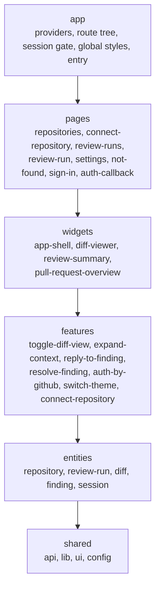
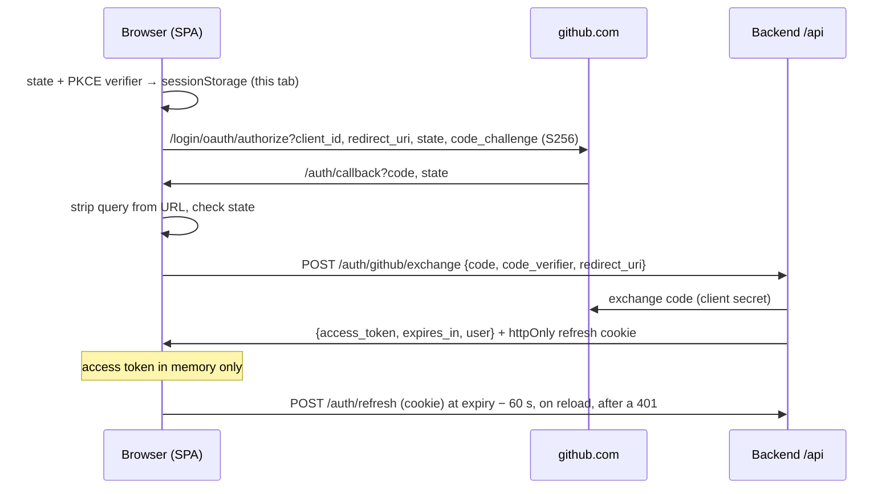

# Frontend architecture

The UI of the AI code-review bot: it lists and connects repositories, shows a review run, the reviewed diff, and the AI findings next to the lines they refer to. This document describes the layer structure, the state management, routes and the app shell, GitHub sign-in, theming, the UI stack, and the base diff components. It ends with a mock of the full application state for one review run.

Stack: React 18, TypeScript (strict), Vite, TanStack Router, TanStack Query, Zustand, Zod, Tailwind CSS v4, shadcn/ui (Radix), Shiki, Vitest + Testing Library.

## Layers (Feature-Sliced Design)



Text version, highest layer first. Arrows point to what a layer may import.

```text
app ──► pages ──► widgets ──► features ──► entities ──► shared
 │        │          │           │            │
 └────────┴──────────┴───────────┴────────────┴──► (any lower layer is allowed too)
```

| Layer      | Slices                                                                                                                              | Responsibility                                                                                                                                   |
| ---------- | ----------------------------------------------------------------------------------------------------------------------------------- | ------------------------------------------------------------------------------------------------------------------------------------------------ |
| `app`      | –                                                                                                                                   | Entry point, `QueryClient`, API adapter selection, route tree, session gate, theme tokens                                                        |
| `pages`    | `repositories`, `connect-repository`, `review-runs`, `review-run`, `settings`, `not-found`, `sign-in`, `auth-callback`              | Screens: connected repositories, connecting one, the run list, a run with its loading / error / empty / partial states, settings, sign-in, OAuth |
| `widgets`  | `app-shell`, `diff-viewer`, `review-summary`, `pull-request-overview`                                                               | Self-contained blocks that combine entities and features; `app-shell` is the signed-in frame                                                     |
| `features` | `toggle-diff-view`, `expand-context`, `reply-to-finding`, `resolve-finding`, `auth-by-github`, `switch-theme`, `connect-repository` | One user action each: UI control + mutation or store update                                                                                      |
| `entities` | `repository`, `review-run`, `diff`, `finding`, `session`                                                                            | Domain model: Zod schemas, query hooks, stores, pure logic, presentational atoms                                                                 |
| `shared`   | segments `api`, `lib`, `ui`, `config`                                                                                               | Domain-free code: API boundaries, mock adapters, env config, PKCE, theme store, highlighter, shadcn                                              |

Inside a slice, code is grouped into segments: `ui/`, `model/` (types, stores, schemas), `api/` (query hooks), and `lib/` (pure helpers).

### Import rules

The rules are enforced by `no-restricted-imports` blocks generated per layer in `eslint.config.js`. `pnpm lint` fails on every violation and names the import.

| Rule                                                                 | Example that fails                                         |
| -------------------------------------------------------------------- | ---------------------------------------------------------- |
| A layer imports only from layers below it                            | `entities/diff` → `@/features/expand-context`              |
| Slices of one layer do not import each other                         | `features/reply-to-finding` → `@/features/resolve-finding` |
| Other slices are imported only through their public API (`index.ts`) | `widgets/diff-viewer` → `@/entities/diff/lib/rows`         |
| Inside a slice, imports are relative and do not climb out of it      | `features/x/ui/a.tsx` → `../../../entities/diff`           |
| A slice's `index.ts` re-exports only its own modules                 | `entities/finding/index.ts` → `export * from '../diff'`    |
| `shared` has no slices, so its modules are imported directly         | allowed: `@/shared/ui/button`, `@/shared/lib/line-anchor`  |

When two entities need the same type, it moves to `shared` (for example `LineAnchor` in `shared/lib/line-anchor.ts`). When an entity component needs a feature or another entity, it exposes a slot instead: `FindingCard` takes `actions`, `suggestion`, and `footer` props, and the `diff-viewer` widget passes the resolve and reply features and the `SuggestedChange` block into them. Likewise `UnifiedLineRow` / `SplitLineRow` take `marker` / `markers` slots, so `entities/diff` stays unaware of findings while the widget draws flagged-line markers in the gutter. Rules that combine entities (the verdict and score use the run and the findings) live in a widget (`widgets/pull-request-overview/lib/verdict.ts`) and take plain counts.

## Data flow and state

```text
ReviewApi adapter ──► Zod schema (.parse + snake→camel transform) ──► TanStack Query cache ──► hooks ──► components
  (shared/api)            (entities/*/model/schema.ts)                   keyed by runId          (entities/*/api)

Zustand stores (entities/*/model/*-store.ts) ◄── features (actions) ──► widgets (selector hooks)
```

| Kind of state    | Where                                 | Examples                                                                                                                                                                                      |
| ---------------- | ------------------------------------- | --------------------------------------------------------------------------------------------------------------------------------------------------------------------------------------------- |
| Server state     | TanStack Query                        | `['runs']` (list), `['run', runId]`, `['run', runId, 'diff']`, `['run', runId, 'findings']`, `['run', runId, 'file', path]`; `['repositories', 'connected']`, `['repositories', 'available']` |
| URL state        | TanStack Router                       | the current page and `runId` (`/runs/$runId`)                                                                                                                                                 |
| Shared client UI | Zustand, read through selector hooks  | `diffViewStore`: view mode, per-file collapse, gap expansions. `findingNavStore`: selected finding, flashed line                                                                              |
| Session          | Zustand (`sessionStore`), memory only | status (`restoring` / `signed-out` / `signed-in`), access token, expiry, GitHub user, sign-out reason                                                                                         |
| Preferences      | Zustand + `localStorage`              | `themeStore` (`dmc268.theme`), `sidebarStore` (`dmc268.sidebar`); never credentials                                                                                                           |
| Local UI         | `useState`                            | reply draft, whether a finding card is expanded                                                                                                                                               |

Rules:

- **Validate at the boundary.** `ReviewApi` methods return `unknown`. Every query hook parses the result with the entity's Zod schema. Invalid data puts the query into the error state, and nothing partial is rendered. The schemas also map the snake_case wire format to camelCase view models, so a backend DTO change only touches the schemas.
- **Key by run.** All query keys start with `['run', runId]`, so a slow response for an old run can never show up under a new one. `queryFn` passes the `AbortSignal` to the adapter.
- **Keep run lifecycle, coverage, and publication separate.** `status` (NEW … CANCELLED), `coverage.status` (complete/partial/failed), and `publication.status` are independent fields, each with its own badge. A run with partial or failed coverage is never shown as "no issues".
- **Mutations.** Resolving a finding is optimistic and rolls back on error (`onMutate` snapshot → `onError` restore → `onSettled` invalidate). A reply is not optimistic: it joins the thread only after the server accepts it, and on failure the draft stays in the input. Connecting a repository is not optimistic either: on success (or `409`, already connected) both `['repositories', …]` queries are refetched, including inactive ones, before the page navigates to `/repositories`, so the list never renders without the new entry.
- **Retries.** Only transient failures are retried, never Zod errors or 4xx responses (`app/providers/query-client.ts`).
- **Replies and resolution are UI-only in v1.** They are not posted to the pull request. The runtime publisher maintains one PR summary, and inline comments are outside v1.

### API adapter

`shared/api/review-api.ts` defines the transport interface. `listRuns()` returns the user's runs (the backend endpoint will be `GET /runs`); the run methods read or change one run; `listRepositories()`, `listAvailableRepositories()` and `connectRepository()` serve the repository screens (see [Repository endpoints](#repository-endpoints-proposed)). The app currently uses `createMockReviewApi()` (`shared/api/mock/`), which serves the mock state below with configurable latency; `listRuns()` returns its single run, so the mock state keeps the shape documented here. Repository fixtures live in `shared/api/mock/repositories.mock.ts`, separate from the run state. For manual testing it has a failure switch: `?mockFail=listRuns,replyToFinding,setFindingStatus,listRepositories,listAvailableRepositories,connectRepository`. A real HTTP client will implement the same interface, and components will not change. Tests inject adapters through `renderWithProviders(ui, { api, authApi })` (`shared/lib/test/render.tsx`). Components that use `Link` or route hooks render through `renderWithRouter(ui, { path, routes })` (`shared/lib/test/render-with-router.tsx`); the real route tree is tested end to end in `app/App.test.tsx`.

## Routes

Navigation uses **TanStack Router** with a route tree written in code in `app/router.tsx`, not file-based routing, which would need a generated `routeTree.gen.ts` outside the layers. `Register` makes `Link`, `useParams`, and `redirect` type-checked in every layer. `staticData.title` gives each route its title.

```text
__root__                     RootLayout: document.title = "<route title> · AI code review"
├── /auth/callback           CallbackRoute → AuthCallbackPage (public, no shell)
└── app (pathless layout)    AppLayout → SessionGate → AppShell + <Outlet/>
    ├── /                    beforeLoad: ?run=<id> → /runs/<id>, otherwise /repositories (replace)
    ├── /repositories        RepositoriesPage        "Repositories"
    ├── /repositories/connect ConnectRepositoryRoute → ConnectRepositoryPage "Connect repository"
    ├── /runs                ReviewRunsPage          "Review runs"
    ├── /runs/$runId         RunRoute → ReviewRunPage "Review run"
    ├── /settings            SettingsRoute → SettingsPage "Settings"
    └── $                    NotFoundPage (inside the shell) "Page not found"
```

- **Gating order.** `beforeLoad` hooks run before the layout renders, so the legacy redirect happens first. A signed-out user who opens `/?run=abc` sees sign-in at `/runs/abc`, and that path is saved as the return path. The session gate is a component, not a `beforeLoad` guard: the restore is an async store transition that the gate already renders as a placeholder.
- **Route components** (`app/ui/routes.tsx`) adapt the router context and params into page props, so pages do not know the route tree. Router context carries `config`, `createReviewApi`, and `queryClient`.
- **Callback.** `useCompleteSignIn` removes `code`/`state` with `history.replaceState` before the exchange. When the exchange succeeds, the route calls `router.history.replace(returnTo)`, so the router owns all navigation.
- **Hosting.** nginx and the Vite servers serve `index.html` for unknown paths, so deep links work without server routes.

## App shell

`widgets/app-shell` is the frame around every signed-in page:

| Region  | Landmark            | Contents                                                                                                                                                                                                                      |
| ------- | ------------------- | ----------------------------------------------------------------------------------------------------------------------------------------------------------------------------------------------------------------------------- |
| Sidebar | `navigation` "Main" | "Repositories" (`/repositories`, section-highlighted on the connect screen), "Review runs" (`/runs`), the open run nested under it (titled from the cached run query), "Settings". `aria-current="page"` marks the exact page |
| Header  | `banner`            | Mobile menu button, route title, "Mock auth" badge in mock mode, `ThemeMenu`, `UserMenu` (avatar + login; name, `@login`, Settings, Sign out)                                                                                 |
| Content | `main#main`         | The matched page. A "Skip to content" link is first in the tab order                                                                                                                                                          |

- **Wide screens (`md` and up):** the sidebar is visible and collapses to an icon rail. The choice persists in `localStorage['dmc268.sidebar']`, and rail items keep an `aria-label` and a tooltip.
- **Narrow screens:** the sidebar is hidden and the header's menu button opens the same `NavList` in a `Sheet` (a modal drawer). Choosing a destination or pressing Escape closes it, and focus returns to the menu button.
- **While the session restores** on page load, `SessionGate` renders `ShellSkeleton`, a shell-shaped placeholder with a status message.
- `shared/ui/button.tsx` forwards its ref. On React 18 Radix triggers (`asChild`) need the element to restore focus and to position menus.

## Authentication

Users sign in with GitHub through a **GitHub App** (user authorization flow). The SPA handles the redirects. The backend exchanges the code, because GitHub's token endpoint needs the client secret and does not allow browser requests. The backend keeps the GitHub tokens and issues its own short-lived app session. Registering the app is described in [docs/github-app-setup.md](docs/github-app-setup.md).



| Piece                                    | Where                                 | What it does                                                                                                                                                     |
| ---------------------------------------- | ------------------------------------- | ---------------------------------------------------------------------------------------------------------------------------------------------------------------- |
| `parseEnv`                               | `shared/config/env.ts`                | Validates the `VITE_*` variables (`.env.example`). In `github` mode a missing or malformed value shows a configuration error naming it                           |
| `AuthApi`                                | `shared/api/auth/`                    | Transport boundary (`exchange`, `refresh`, `logout`), with the HTTP adapter and the mock adapter (`VITE_AUTH_MODE=mock`, the default)                            |
| `createAuthorizedFetch`                  | `shared/api/auth/authorized-fetch.ts` | Bearer header. On a 401: one shared refresh and one retry. A second 401 signs out. For the future HTTP `ReviewApi`                                               |
| `sessionStore`, `refreshSession`         | `entities/session`                    | In-memory session. Single-flight refresh: a 401 signs out with reason `expired`, while network errors and 5xx keep the user signed in                            |
| `useSessionRefreshScheduler`             | `entities/session`                    | Refreshes at `expiresAt − 60 s`, right away when a sleeping tab becomes visible past that time, and retries transient failures (5 / 15 / 30 s)                   |
| `startGithubSignIn`, `useCompleteSignIn` | `features/auth-by-github`             | Authorize redirect, and callback handling with state check, a StrictMode-safe single exchange, and a same-origin return path                                     |
| `SessionGate`, route tree                | `app/`                                | `/auth/callback` is public. Every other route restores the session, then shows sign-in or the shell (see Routes). The query cache is cleared when a session ends |

Rules:

- **No credentials in web storage.** The access token lives only in `sessionStore`. The refresh token is an httpOnly cookie the SPA cannot read. `sessionStorage` holds only the one-time `state` and verifier, which are deleted when the callback reads them. In mock mode it also holds a stand-in for the refresh cookie, which contains the mock user and no token.
- **Secrets stay on the backend.** The client secret, private key, and webhook secret never get a `VITE_` prefix, because every `VITE_*` value is public.
- **Review data is per user.** The `ReviewApi` is created inside the signed-in shell (keyed by user ID, so replies carry the GitHub login), and sign-out clears the TanStack Query cache.

### Backend contract

The endpoints are relative to `VITE_API_BASE_URL`, which must be same-site with the SPA so the `SameSite=Lax` cookie is sent. Requests send credentials. `user` is `{ id, login, name, avatar_url }`, and `expires_in` is in seconds.

| Endpoint                     | Request                                 | Success                                                   | Errors                                    |
| ---------------------------- | --------------------------------------- | --------------------------------------------------------- | ----------------------------------------- |
| `POST /auth/github/exchange` | `{ code, code_verifier, redirect_uri }` | `200 { access_token, expires_in, user }` + refresh cookie | `400` invalid code, `502` GitHub down     |
| `POST /auth/refresh`         | refresh cookie                          | `200 { access_token, expires_in, user }` + rotated cookie | `401` missing, invalid, or revoked cookie |
| `POST /auth/logout`          | refresh cookie, `Authorization: Bearer` | `204`, cookie cleared                                     | –                                         |

The refresh cookie should be `HttpOnly; Secure; SameSite=Lax; Path=/api/auth`. The backend should also accept the previous refresh token for a short grace period after rotation, so two tabs that refresh at the same moment do not sign each other out. Other API calls authenticate with `Authorization: Bearer <access_token>`.

### Repository endpoints (proposed)

**Not an approved contract.** The repository screens run on the mock adapter. These shapes follow the system design's `Repository` (provider, external ID, name, URL, default branch) and are a proposal for the backend owner; only `shared/api/types.ts`, the `entities/repository` schemas and the future HTTP adapter depend on them. All requests use `Authorization: Bearer <access_token>`.

| Endpoint                      | Request                     | Success                         | Errors                                                             |
| ----------------------------- | --------------------------- | ------------------------------- | ------------------------------------------------------------------ |
| `GET /repositories`           | –                           | `200 RepositoryWire[]`          | `401`                                                              |
| `GET /repositories/available` | –                           | `200 AvailableRepositoryWire[]` | `401`, `502` provider down                                         |
| `POST /repositories`          | `{ provider, external_id }` | `201 RepositoryWire`            | `409` already connected, `403`/`404` the reviewer cannot access it |

`RepositoryWire` is `{ repository_id, provider, external_id, full_name, url, default_branch, private, connected_at }`. `AvailableRepositoryWire` has the same repository fields plus `repository_id`, which is `null` until the repository is connected. `provider` is `github` or `gitlab`. `external_id` is a string, because provider IDs differ in kind and may exceed the safe integer range. `url` must be an absolute `https` URL; the UI rejects the whole list otherwise, so no other scheme reaches an `href`. Open questions for the backend: pagination or server-side search of available repositories, and whether connecting needs a `Project`.

`VITE_GITHUB_APP_SLUG` (optional, public) makes the connect screen link to `https://github.com/apps/<slug>/installations/new`, where users give the app access to more repositories.

## Theming

The user picks **Light**, **Dark**, or **System** (default). The CSS owns the themes: `<html data-theme="light|dark">` forces one, and no attribute means the `prefers-color-scheme` rules apply, which follow OS changes live without any JS.

- `shared/lib/theme.ts` holds the `themeStore`. `setPreference` saves the choice to `localStorage['dmc268.theme']` and sets or removes `data-theme`. Reading storage is guarded: a missing or unknown value, or storage that throws, means `system`.
- **No flash on load.** An inline `<script id="theme-init">` in the `index.html` `<head>` applies a stored `light`/`dark` before the first paint. `main.tsx` then syncs the store with `themeStore.getState().init()`. A test checks that the script's storage key equals `THEME_STORAGE_KEY`. A future strict CSP must allow this script by hash.
- `color-scheme` follows the theme (`light` on `:root`, `dark` with the dark tokens), so scrollbars and native form controls match.
- Switchers (`features/switch-theme`): `ThemeMenu`, an icon button with a radio menu, is in the header. `ThemeToggleGroup`, a segmented control, is in Settings and on the sign-in screen. Both read the same store, so they stay in sync.

## UI stack and design tokens

- **Tailwind CSS v4** (`@tailwindcss/vite`). All colors are CSS variables on `:root` in `src/app/styles/index.css`, redefined for dark mode. Dark mode follows the OS unless `<html data-theme="light|dark">` overrides it. The variables are exposed to Tailwind through `@theme inline`, for example `bg-diff-add` and `text-severity-warning`.
- **shadcn/ui** primitives (Radix) are generated into `src/shared/ui/` (`components.json`). The `cva` variant definitions live in `*-variants.ts` files, so component files stay fast-refresh friendly.
- **Shiki** (core + JavaScript regex engine, lazy-loaded). Tokens are rendered as React `<span>` elements carrying `--shiki-light` and `--shiki-dark` variables. Nothing is ever injected as HTML.

| Token group | Variables                                                                                                       |
| ----------- | --------------------------------------------------------------------------------------------------------------- |
| Surfaces    | `--background`, `--foreground`, `--card`, `--muted`, `--muted-foreground`, `--border`, `--ring`, …              |
| Diff        | `--diff-add-bg`, `--diff-add-gutter`, `--diff-del-bg`, `--diff-del-gutter`, `--diff-ctx-bg`, `--diff-gap-bg`    |
|             | `--diff-gap-fg`, `--diff-filler-bg`, `--diff-highlight`, `--diff-add-fg`, `--diff-del-fg`                       |
| Severity    | `--severity-{critical,warning,info}` (text) and `--severity-*-bg`, one pair per display group; contrast ≥ 4.5:1 |
| Code        | `--font-mono`, `--leading-code` (20px)                                                                          |

## Components

| Component                                  | Slice                                  | Purpose                                                                                                                                                                               |
| ------------------------------------------ | -------------------------------------- | ------------------------------------------------------------------------------------------------------------------------------------------------------------------------------------- |
| `CodeBlock`                                | `shared/ui/code-block`                 | Read-only snippet: line numbers from `startLine`, syntax highlighting, `highlightLines`                                                                                               |
| `parseUnifiedDiff`                         | `entities/diff`                        | Strict unified/git diff parser: files, hunks, line numbers, renames, binary files; fails as a whole on errors                                                                         |
| `buildUnifiedRows`, `buildSplitRows`       | `entities/diff`                        | Pure row models for both layouts, including collapsed gaps and revealed context lines                                                                                                 |
| `expansionsForAnchors`, `placeOn*Rows`     | `entities/diff`                        | Reveal anchored lines hidden in gaps; attach findings to rows; collect unplaced findings                                                                                              |
| `UnifiedLineRow`, `SplitLineRow`, `GapRow` | `entities/diff`                        | Row atoms with gutters, `+`/`-` markers, a screen-reader change-type label, `data-anchors` for navigation                                                                             |
| `FindingCard`, `SeverityBadge`             | `entities/finding`                     | Expandable finding: Critical / Warning / Info badge plus the level as text, rule, evidence, impact, recommendation, suggestion slot, confidence, related lines, replies               |
| `SuggestedChange`                          | `entities/finding`                     | AI-suggested replacement as a highlighted −/+ mini diff, "not applied" label, "Copy suggestion"; replacement-only when the original lines are unknown                                 |
| `headLines`                                | `entities/diff`                        | Head-side text of a line range from the file content, falling back to the diff's RIGHT lines; `null` when any line is unknown                                                         |
| `DiffViewModeToggle`                       | `features/toggle-diff-view`            | Unified / split switch for all files                                                                                                                                                  |
| `ExpandContextControls`                    | `features/expand-context`              | "Expand 20 lines" / "Expand all"; explains when the file content is unavailable                                                                                                       |
| `ReplyForm`                                | `features/reply-to-finding`            | Reply input, blank replies rejected, draft kept on failure                                                                                                                            |
| `ResolveFindingToggle`                     | `features/resolve-finding`             | Resolve / unresolve with optimistic update and rollback                                                                                                                               |
| `DiffViewer`                               | `widgets/diff-viewer`                  | Files with headers, collapsible bodies, inline findings with suggested changes, flagged-line gutter markers (`FlaggedLineMarker`), unplaced findings, scroll-to-line navigation       |
| `PullRequestOverview`                      | `widgets/pull-request-overview`        | Page heading (PR title), repository and number, short SHA, author, `base ← head`, provider link, run / coverage / publication badges, derived verdict and heuristic score             |
| `ReviewSummary`                            | `widgets/review-summary`               | Coverage limitations, Critical / Warning / Info counts, resolved / unresolved counts, next/previous finding                                                                           |
| `ReviewRunPage`                            | `pages/review-run`                     | Loading, error with retry, in-progress, "no issues" (complete coverage only), composed view                                                                                           |
| `SignInButton`, `UserMenu`                 | `features/auth-by-github`              | "Sign in with GitHub" with a redirecting state; avatar, login, and sign-out                                                                                                           |
| `SignInPage`, `AuthCallbackPage`           | `pages/sign-in`, `pages/auth-callback` | Sign-in, "session expired", configuration errors; "Signing you in…" and cancelled / unverified / failed with "Try again"                                                              |
| `AppShell`, `ShellSkeleton`                | `widgets/app-shell`                    | Signed-in frame (skip link, sidebar, header, main); shell-shaped placeholder while the session restores                                                                               |
| `Sidebar`, `NavList`, `Header`             | `widgets/app-shell`                    | Collapsible rail with tooltips; the same nav in a mobile drawer; route title, badges, theme and user menus                                                                            |
| `ThemeMenu`, `ThemeToggleGroup`            | `features/switch-theme`                | Light / Dark / System switchers sharing `themeStore`                                                                                                                                  |
| `ReviewRunsPage`                           | `pages/review-runs`                    | Run list, newest first, with run and coverage badges; loading, empty, and error with retry                                                                                            |
| `SettingsPage`, `NotFoundPage`             | `pages/settings`, `pages/not-found`    | Appearance (theme) and Account (GitHub identity, auth mode); "Page not found" with a link to Review runs                                                                              |
| `ProviderBadge`, `VisibilityBadge`         | `entities/repository`                  | "GitHub" / "GitLab" and "Private" / "Public" as text badges                                                                                                                           |
| `ConnectRepositoryButton`                  | `features/connect-repository`          | "Connect" for one repository: its own pending state, one request per click, inline error that keeps the action available                                                              |
| `RepositoriesPage`                         | `pages/repositories`                   | Connected repositories by full name with provider, visibility, default branch, connection time and an external link; loading, empty (with "Connect repository"), and error with retry |
| `ConnectRepositoryPage`                    | `pages/connect-repository`             | Accessible repositories with a name filter, "Connect" or "Connected" per row, the optional GitHub App installation link; loading, empty, and error with retry                         |

Accessibility: all controls are native buttons with accessible names, so they work with Tab and Enter. Every diff line has a visually hidden "Added line" / "Removed line" / "Unchanged line" label. Severity is always shown as text as well as color.

## Review run screen

`/runs/$runId` composes `PullRequestOverview`, `ReviewSummary`, the run-state notice, and `DiffViewer`.

- **Severity display groups.** The wire contract keeps four levels (`critical`, `high`, `medium`, `low`), and validation and ordering use them. The UI shows three groups: Critical (`critical`), Warning (`high`, `medium`), and Info (`low`). Cards also show the level as text (`entities/finding/lib/severity.ts`).
- **Verdict and score** are derived on the client (`widgets/pull-request-overview/lib/verdict.ts`). The verdict is, in order: "Review in progress" (NEW / QUEUED / RUNNING), "No verdict" (FAILED, CANCELLED, or failed coverage), "Changes requested" (any Critical), "Needs attention" (any Warning), "Partially reviewed" (partial coverage), then "No blocking issues". The score is `100 − 25·critical − 8·high − 4·medium − 1·low`, floored at 0, and shown only for a completed run with complete coverage. Both count all findings, because resolving is UI-only and proves no fix.
- **Proposed wire fields (not an approved contract).** `ReviewRunWire` gets optional `author` (`{ login, avatar_url }`), `base_branch`, `head_branch`, and `pull_request_url`. `FindingWire` gets optional `suggested_change` (`{ start_line, end_line, replacement }`): head-side lines of the anchor file, never on a LEFT anchor, and an empty replacement means removal. URLs must be absolute `https` (`shared/lib/https-url.ts`), otherwise the run fails validation. Payloads without these fields still validate, and the UI leaves out what it has no data for.

## Testing

`pnpm test` runs Vitest (jsdom). Tests sit next to the code they cover:

- Pure logic: the diff parser, row builders, gap expansion, finding placement and ordering, stores, and the mock adapter.
- Components: they render through `renderWithProviders` with an injected adapter, so error and rollback paths come from the adapter's failure switch, not from module mocks.
- Shiki is stubbed in `src/shared/config/test-setup.ts`, so component tests render the plain-text fallback. The highlighter's own tests use the real Shiki.
- `src/shared/api/mock/app-state.mock.test.ts` checks that the mock state below matches the source file.

## Mock application state

The state of the app for one review run. `server` is what the backend returns (wire format), and it lives in the TanStack Query cache after validation. `client` is the initial shared UI state in the Zustand stores. The block below is the file `src/shared/api/mock/app-state.mock.ts`. The type checker validates that file, and a test fails if this copy drifts from it.

<!-- mock-state:start -->

```ts
import type { FindingWire, ReviewRunWire } from '../types'

/**
 * Mock application state for one review run. It is the single source of the
 * fixtures used by the mock API adapter, and it is embedded verbatim in
 * FRONTEND_ARCHITECTURE.md (a test keeps both in sync).
 *
 * - `server` is what the backend would return (wire format, snake_case).
 *   It lives in the TanStack Query cache after validation.
 * - `client` is the initial shared UI state held in Zustand stores.
 */
export interface MockAppState {
  server: {
    run: ReviewRunWire
    /** Unified diff text between base_sha and head_sha. */
    diffText: string
    findings: FindingWire[]
    /** Head-side file contents by path; null when the backend could not provide them. */
    fileContents: Record<string, string | null>
  }
  client: {
    diffView: {
      mode: 'unified' | 'split'
      /** Explicit per-file collapse choices; files not listed use the default. */
      fileCollapse: Record<string, boolean>
      /** Revealed context lines per gap, keyed by `${runId}:${path}:${gapIndex}`. */
      expandedGaps: Record<string, { top: number; bottom: number }>
    }
    findingNav: {
      selectedFindingId: string | null
    }
  }
}

export const RUN_ID = 'run-2026-10-07-001'

const diffText =
  [
    'diff --git a/assets/logo.png b/assets/logo.png',
    'index c866266..5663091 100644',
    'Binary files a/assets/logo.png and b/assets/logo.png differ',
    'diff --git a/config/settings.py b/config/settings.py',
    'index 374755c..9c7bd41 100644',
    '--- a/config/settings.py',
    '+++ b/config/settings.py',
    "@@ -32,7 +32,7 @@ OPTION_28 = os.environ.get('OPTION_28', '28')",
    " OPTION_29 = os.environ.get('OPTION_29', '29')",
    " OPTION_30 = os.environ.get('OPTION_30', '30')",
    ' ',
    '-DEBUG = False',
    "-ALLOWED_HOSTS = ['example.com']",
    '+DEBUG = True',
    "+ALLOWED_HOSTS = ['*']",
    ' ',
    '-SESSION_TTL = 3600',
    "+SESSION_TTL = int(os.environ.get('SESSION_TTL', '3600'))",
    'diff --git a/src/api/search-endpoint.ts b/src/api/search-endpoint.ts',
    'new file mode 100644',
    'index 0000000..b938dfe',
    '--- /dev/null',
    '+++ b/src/api/search-endpoint.ts',
    '@@ -0,0 +1,8 @@',
    "+import { searchUsers } from '../services/user-service'",
    "+import type { Request, Response } from '../http'",
    '+',
    '+export async function handleSearch(req: Request, res: Response): Promise<void> {',
    "+  const term = String(req.query.q ?? '')",
    '+  const users = await searchUsers(term)',
    "+  res.send(`<h1>Results for ${term}</h1>` + users.map((u) => u.name).join('<br>'))",
    '+}',
    'diff --git a/src/legacy/old-helper.js b/src/legacy/old-helper.js',
    'deleted file mode 100644',
    'index b0408b0..0000000',
    '--- a/src/legacy/old-helper.js',
    '+++ /dev/null',
    '@@ -1,4 +0,0 @@',
    '-// Deprecated: use formatCount from utils/formatting instead.',
    '-export function pad(value) {',
    "-  return String(value).padStart(2, '0')",
    '-}',
    'diff --git a/src/services/user-service.ts b/src/services/user-service.ts',
    'index 8a3a767..6c10b7f 100644',
    '--- a/src/services/user-service.ts',
    '+++ b/src/services/user-service.ts',
    '@@ -17,9 +17,6 @@ function clampPageSize(size: number | undefined): number {',
    ' }',
    ' ',
    ' export async function getUser(id: string): Promise<User | null> {',
    '-  if (!id) {',
    '-    return null',
    '-  }',
    "   const rows = await db.query('SELECT * FROM users WHERE id = $1', [id])",
    '   return rows[0] ?? null',
    ' }',
    '@@ -44,6 +41,11 @@ export async function countActiveUsers(): Promise<number> {',
    '   return Number(rows[0]?.total ?? 0)',
    ' }',
    ' ',
    '+export async function searchUsers(term: string): Promise<User[]> {',
    '+  // Matches users by name or email.',
    "+  return db.query(`SELECT * FROM users WHERE name LIKE '%${term}%' OR email LIKE '%${term}%'`)",
    '+}',
    '+',
    ' export async function touchLastSeen(id: string): Promise<void> {',
    "   await db.query('UPDATE users SET last_seen_at = now() WHERE id = $1', [id])",
    ' }',
    'diff --git a/src/utils/format.ts b/src/utils/formatting.ts',
    'similarity index 47%',
    'rename from src/utils/format.ts',
    'rename to src/utils/formatting.ts',
    'index c8f9983..edf89d7 100644',
    '--- a/src/utils/format.ts',
    '+++ b/src/utils/formatting.ts',
    '@@ -2,6 +2,6 @@ export function formatDate(value: Date): string {',
    '   return value.toISOString().slice(0, 10)',
    ' }',
    ' ',
    '-export function formatCount(value: number): string {',
    "-  return value.toLocaleString('en-US')",
    "+export function formatCount(value: number, locale = 'en-US'): string {",
    '+  return value.toLocaleString(locale)',
    ' }',
  ].join('\n') + '\n'

export const mockAppState: MockAppState = {
  server: {
    run: {
      run_id: RUN_ID,
      title: 'Add user search endpoint',
      repository: 'larchanka-training/dmc-268-demo',
      pull_request: 42,
      status: 'COMPLETED',
      coverage: {
        status: 'partial',
        limitations: [
          'assets/logo.png is a binary file and was not reviewed.',
          'config/settings.py: full file content was unavailable; only the diff hunks were analyzed.',
        ],
      },
      publication: { status: 'published' },
      base_sha: '8a3a7671c2f04b4a9a7e3f1d2b5c6e7f8a9b0c1d',
      head_sha: '6c10b7f0e9d8c7b6a5f4e3d2c1b0a9f8e7d6c5b4',
      rules_version: 'rules-2026-10-01',
      created_at: '2026-10-07T09:12:00Z',
      author: { login: 'octocat', avatar_url: 'https://avatars.githubusercontent.com/u/583231' },
      base_branch: 'main',
      head_branch: 'feature/user-search',
      pull_request_url: 'https://github.com/larchanka-training/dmc-268-demo/pull/42',
    },
    diffText,
    findings: [
      {
        finding_id: 'f-sql-injection',
        rule_id: 'SEC-SQL-001',
        title: 'User input is interpolated into a SQL query',
        severity: 'critical',
        anchor: { path: 'src/services/user-service.ts', side: 'RIGHT', line: 46 },
        related_changed_lines: [{ path: 'src/services/user-service.ts', side: 'RIGHT', line: 46 }],
        evidence: "searchUsers builds the query with a template literal: name LIKE '%${term}%'.",
        impact:
          'A crafted search term can read or modify any table the service account can access.',
        recommendation:
          "Use a parameterized query: db.query('... WHERE name LIKE $1 OR email LIKE $1', [`%${term}%`]).",
        confidence: 0.94,
        status: 'open',
        replies: [],
      },
      {
        finding_id: 'f-null-check',
        rule_id: 'COR-NULL-003',
        title: 'Empty id guard was removed from getUser',
        severity: 'high',
        anchor: { path: 'src/services/user-service.ts', side: 'LEFT', line: 20 },
        related_changed_lines: [
          { path: 'src/services/user-service.ts', side: 'LEFT', line: 20 },
          { path: 'src/services/user-service.ts', side: 'LEFT', line: 21 },
          { path: 'src/services/user-service.ts', side: 'LEFT', line: 22 },
        ],
        evidence:
          'The early return for a falsy id is deleted; getUser now queries with an empty id.',
        impact:
          'Callers that relied on a null result now trigger a database round-trip and may get unexpected rows.',
        recommendation:
          'Keep the guard or validate the id at the API boundary before calling getUser.',
        confidence: 0.81,
        status: 'open',
        replies: [],
      },
      {
        finding_id: 'f-deactivate-validation',
        rule_id: 'COR-INPUT-002',
        title: 'deactivateUser accepts an empty id as well',
        severity: 'medium',
        anchor: { path: 'src/services/user-service.ts', side: 'RIGHT', line: 35 },
        related_changed_lines: [{ path: 'src/services/user-service.ts', side: 'LEFT', line: 20 }],
        evidence:
          'With the getUser guard removed, no function in this module validates the id parameter.',
        impact: 'An empty id produces a no-op UPDATE that is logged as a successful deactivation.',
        recommendation:
          'Validate ids once in a shared helper and use it in every exported function.',
        confidence: 0.62,
        status: 'open',
        replies: [],
      },
      {
        finding_id: 'f-reflected-xss',
        rule_id: 'SEC-XSS-002',
        title: 'Search term is reflected into HTML without escaping',
        severity: 'high',
        anchor: { path: 'src/api/search-endpoint.ts', side: 'RIGHT', line: 7 },
        related_changed_lines: [{ path: 'src/api/search-endpoint.ts', side: 'RIGHT', line: 7 }],
        evidence:
          'A request with q= is written into the response body as-is.',
        impact: "Attackers can run script in the victim's browser through a crafted link.",
        recommendation: 'Return JSON, or escape term and user names before building HTML.',
        confidence: 0.9,
        status: 'open',
        replies: [],
        suggested_change: {
          start_line: 7,
          end_line: 7,
          replacement: '  res.json({ term, users: users.map((u) => u.name) })',
        },
      },
      {
        finding_id: 'f-debug-enabled',
        rule_id: 'SEC-CONF-001',
        title: 'DEBUG is enabled in shared settings',
        severity: 'high',
        anchor: { path: 'config/settings.py', side: 'RIGHT', line: 35 },
        related_changed_lines: [{ path: 'config/settings.py', side: 'RIGHT', line: 35 }],
        evidence: 'DEBUG = True is set unconditionally in config/settings.py.',
        impact: 'Debug pages can expose stack traces and settings in production.',
        recommendation: 'Read DEBUG from the environment and default it to False.',
        confidence: 0.88,
        status: 'open',
        replies: [],
        suggested_change: {
          start_line: 35,
          end_line: 35,
          replacement: "DEBUG = os.environ.get('DEBUG', 'False') == 'True'",
        },
      },
      {
        finding_id: 'f-wildcard-hosts',
        rule_id: 'SEC-CONF-004',
        title: 'ALLOWED_HOSTS accepts any host',
        severity: 'medium',
        anchor: { path: 'config/settings.py', side: 'RIGHT', line: 36 },
        related_changed_lines: [{ path: 'config/settings.py', side: 'RIGHT', line: 36 }],
        evidence: "ALLOWED_HOSTS = ['*'] replaces the explicit host list.",
        impact: 'Host header attacks become possible (password reset poisoning, cache poisoning).',
        recommendation: 'Keep an explicit host list per environment.',
        confidence: 0.7,
        status: 'resolved',
        replies: [
          {
            reply_id: 'r-1',
            author: 'anna.dev',
            body: 'This settings file is only used by the local docker-compose setup.',
            created_at: '2026-10-07T09:30:00Z',
          },
          {
            reply_id: 'r-2',
            author: 'anna.dev',
            body: 'Resolving; production hosts come from the deployment config.',
            created_at: '2026-10-07T09:31:00Z',
          },
        ],
        suggested_change: {
          start_line: 36,
          end_line: 36,
          replacement: "ALLOWED_HOSTS = os.environ.get('ALLOWED_HOSTS', 'example.com').split(',')",
        },
      },
      {
        finding_id: 'f-locale-default',
        rule_id: 'MNT-DUP-001',
        title: 'Locale default duplicates the app-wide locale setting',
        severity: 'low',
        anchor: { path: 'src/utils/formatting.ts', side: 'RIGHT', line: 42 },
        related_changed_lines: [{ path: 'src/utils/formatting.ts', side: 'RIGHT', line: 5 }],
        evidence: "formatCount hard-codes 'en-US' as its default locale.",
        impact: 'Changing the app locale will not affect number formatting.',
        recommendation: 'Read the default from the shared locale config.',
        confidence: 0.41,
        status: 'open',
        replies: [],
      },
    ],
    fileContents: {
      'src/services/user-service.ts':
        [
          "import { db } from '../db'",
          "import { logger } from '../logger'",
          "import type { User, UserFilter } from '../types'",
          '',
          'const DEFAULT_PAGE_SIZE = 20',
          'const MAX_PAGE_SIZE = 100',
          '',
          '/**',
          ' * Normalizes a page size coming from the query string.',
          ' * Falls back to the default when the value is missing or invalid.',
          ' */',
          'function clampPageSize(size: number | undefined): number {',
          '  if (size === undefined || Number.isNaN(size)) {',
          '    return DEFAULT_PAGE_SIZE',
          '  }',
          '  return Math.min(Math.max(size, 1), MAX_PAGE_SIZE)',
          '}',
          '',
          'export async function getUser(id: string): Promise<User | null> {',
          "  const rows = await db.query('SELECT * FROM users WHERE id = $1', [id])",
          '  return rows[0] ?? null',
          '}',
          '',
          'export async function listUsers(filter: UserFilter): Promise<User[]> {',
          '  const pageSize = clampPageSize(filter.pageSize)',
          '  const offset = (filter.page ?? 0) * pageSize',
          "  logger.debug('listing users', { pageSize, offset })",
          "  return db.query('SELECT * FROM users ORDER BY created_at LIMIT $1 OFFSET $2', [",
          '    pageSize,',
          '    offset,',
          '  ])',
          '}',
          '',
          'export async function deactivateUser(id: string): Promise<void> {',
          "  await db.query('UPDATE users SET active = false WHERE id = $1', [id])",
          "  logger.info('user deactivated', { id })",
          '}',
          '',
          'export async function countActiveUsers(): Promise<number> {',
          "  const rows = await db.query('SELECT count(*) AS total FROM users WHERE active = true')",
          '  return Number(rows[0]?.total ?? 0)',
          '}',
          '',
          'export async function searchUsers(term: string): Promise<User[]> {',
          '  // Matches users by name or email.',
          "  return db.query(`SELECT * FROM users WHERE name LIKE '%${term}%' OR email LIKE '%${term}%'`)",
          '}',
          '',
          'export async function touchLastSeen(id: string): Promise<void> {',
          "  await db.query('UPDATE users SET last_seen_at = now() WHERE id = $1', [id])",
          '}',
          '',
          'export async function deleteUser(id: string): Promise<void> {',
          "  await db.query('DELETE FROM users WHERE id = $1', [id])",
          "  logger.warn('user deleted', { id })",
          '}',
        ].join('\n') + '\n',
      'src/utils/formatting.ts':
        [
          'export function formatDate(value: Date): string {',
          '  return value.toISOString().slice(0, 10)',
          '}',
          '',
          "export function formatCount(value: number, locale = 'en-US'): string {",
          '  return value.toLocaleString(locale)',
          '}',
        ].join('\n') + '\n',
      'src/api/search-endpoint.ts':
        [
          "import { searchUsers } from '../services/user-service'",
          "import type { Request, Response } from '../http'",
          '',
          'export async function handleSearch(req: Request, res: Response): Promise<void> {',
          "  const term = String(req.query.q ?? '')",
          '  const users = await searchUsers(term)',
          "  res.send(`<h1>Results for ${term}</h1>` + users.map((u) => u.name).join('<br>'))",
          '}',
        ].join('\n') + '\n',
      'config/settings.py': null,
    },
  },
  client: {
    diffView: {
      mode: 'unified',
      fileCollapse: {},
      expandedGaps: {},
    },
    findingNav: {
      selectedFindingId: null,
    },
  },
}
```

<!-- mock-state:end -->
