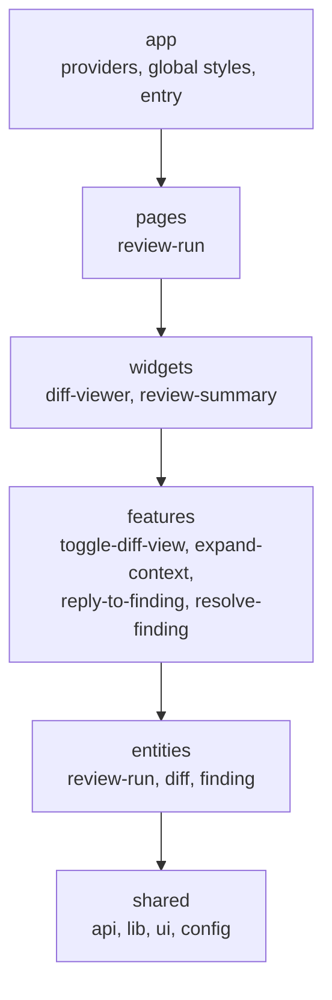

# Frontend architecture

The UI of the AI code-review bot: it shows a review run, the reviewed diff, and the AI findings next to the lines they refer to. This document describes the layer structure, the state management, the UI stack, and the base diff components. It ends with a mock of the full application state for one review run.

Stack: React 18, TypeScript (strict), Vite, TanStack Query, Zustand, Zod, Tailwind CSS v4, shadcn/ui (Radix), Shiki, Vitest + Testing Library.

## Layers (Feature-Sliced Design)



Text version, highest layer first. Arrows point to what a layer may import.

```text
app ──► pages ──► widgets ──► features ──► entities ──► shared
 │        │          │           │            │
 └────────┴──────────┴───────────┴────────────┴──► (any lower layer is allowed too)
```

| Layer      | Slices                                                                      | Responsibility                                                                       |
| ---------- | --------------------------------------------------------------------------- | ------------------------------------------------------------------------------------ |
| `app`      | –                                                                           | Entry point, `QueryClient`, API adapter selection, theme tokens                      |
| `pages`    | `review-run`                                                                | Loads a run, decides loading / error / empty / partial states, composes widgets      |
| `widgets`  | `diff-viewer`, `review-summary`                                             | Self-contained page blocks that combine entities and features                        |
| `features` | `toggle-diff-view`, `expand-context`, `reply-to-finding`, `resolve-finding` | One user action each: UI control + mutation or store update                          |
| `entities` | `review-run`, `diff`, `finding`                                             | Domain model: Zod schemas, query hooks, stores, pure logic, presentational atoms     |
| `shared`   | segments `api`, `lib`, `ui`, `config`                                       | Domain-free code: API boundary, mock adapter, highlighter, shadcn primitives, tokens |

Inside a slice, code is grouped into segments: `ui/`, `model/` (types, stores, schemas), `api/` (query hooks), and `lib/` (pure helpers).

### Import rules

The rules are enforced by `no-restricted-imports` blocks generated per layer in `eslint.config.js`. `pnpm lint` fails on every violation and names the import.

| Rule                                                                 | Example that fails                                         |
| -------------------------------------------------------------------- | ---------------------------------------------------------- |
| A layer imports only from layers below it                            | `entities/diff` → `@/features/expand-context`              |
| Slices of one layer do not import each other                         | `features/reply-to-finding` → `@/features/resolve-finding` |
| Other slices are imported only through their public API (`index.ts`) | `widgets/diff-viewer` → `@/entities/diff/lib/rows`         |
| Inside a slice, imports are relative and do not climb out of it      | `features/x/ui/a.tsx` → `../../../entities/diff`           |
| A slice's `index.ts` re-exports only its own modules                 | `entities/finding/index.ts` → `export * from '../diff'`    |
| `shared` has no slices, so its modules are imported directly         | allowed: `@/shared/ui/button`, `@/shared/lib/line-anchor`  |

When two entities need the same type, it moves to `shared` (for example `LineAnchor` in `shared/lib/line-anchor.ts`). When an entity component needs a feature, it exposes a slot instead: `FindingCard` takes `actions` and `footer` props, and the `diff-viewer` widget passes the resolve and reply features into them.

## Data flow and state

```text
ReviewApi adapter ──► Zod schema (.parse + snake→camel transform) ──► TanStack Query cache ──► hooks ──► components
  (shared/api)            (entities/*/model/schema.ts)                   keyed by runId          (entities/*/api)

Zustand stores (entities/*/model/*-store.ts) ◄── features (actions) ──► widgets (selector hooks)
```

| Kind of state    | Where                                | Examples                                                                                                         |
| ---------------- | ------------------------------------ | ---------------------------------------------------------------------------------------------------------------- |
| Server state     | TanStack Query                       | `['run', runId]`, `['run', runId, 'diff']`, `['run', runId, 'findings']`, `['run', runId, 'file', path]`         |
| Shared client UI | Zustand, read through selector hooks | `diffViewStore`: view mode, per-file collapse, gap expansions. `findingNavStore`: selected finding, flashed line |
| Local UI         | `useState`                           | reply draft, whether a finding card is expanded                                                                  |

Rules:

- **Validate at the boundary.** `ReviewApi` methods return `unknown`. Every query hook parses the result with the entity's Zod schema. Invalid data puts the query into the error state, and nothing partial is rendered. The schemas also map the snake_case wire format to camelCase view models, so a backend DTO change only touches the schemas.
- **Key by run.** All query keys start with `['run', runId]`, so a slow response for an old run can never show up under a new one. `queryFn` passes the `AbortSignal` to the adapter.
- **Keep run lifecycle, coverage, and publication separate.** `status` (NEW … CANCELLED), `coverage.status` (complete/partial/failed), and `publication.status` are independent fields, each with its own badge. A run with partial or failed coverage is never shown as "no issues".
- **Mutations.** Resolving a finding is optimistic and rolls back on error (`onMutate` snapshot → `onError` restore → `onSettled` invalidate). A reply is not optimistic: it joins the thread only after the server accepts it, and on failure the draft stays in the input.
- **Retries.** Only transient failures are retried, never Zod errors or 4xx responses (`app/providers/query-client.ts`).
- **Replies and resolution are UI-only in v1.** They are not posted to the pull request. The runtime publisher maintains one PR summary, and inline comments are outside v1.

### API adapter

`shared/api/review-api.ts` defines the transport interface. The app currently uses `createMockReviewApi()` (`shared/api/mock/`), which serves the mock state below with configurable latency. For manual testing it has a failure switch: `?mockFail=replyToFinding,setFindingStatus`. A real HTTP client will implement the same interface, and components will not change. Tests inject adapters through `renderWithProviders(ui, { api })` (`shared/lib/test/render.tsx`).

## UI stack and design tokens

- **Tailwind CSS v4** (`@tailwindcss/vite`). All colors are CSS variables on `:root` in `src/app/styles/index.css`, redefined for dark mode. Dark mode follows the OS unless `<html data-theme="light|dark">` overrides it. The variables are exposed to Tailwind through `@theme inline`, for example `bg-diff-add` and `text-severity-high`.
- **shadcn/ui** primitives (Radix) are generated into `src/shared/ui/` (`components.json`). The `cva` variant definitions live in `*-variants.ts` files, so component files stay fast-refresh friendly.
- **Shiki** (core + JavaScript regex engine, lazy-loaded). Tokens are rendered as React `<span>` elements carrying `--shiki-light` and `--shiki-dark` variables. Nothing is ever injected as HTML.

| Token group | Variables                                                                                                    |
| ----------- | ------------------------------------------------------------------------------------------------------------ |
| Surfaces    | `--background`, `--foreground`, `--card`, `--muted`, `--muted-foreground`, `--border`, `--ring`, …           |
| Diff        | `--diff-add-bg`, `--diff-add-gutter`, `--diff-del-bg`, `--diff-del-gutter`, `--diff-ctx-bg`, `--diff-gap-bg` |
|             | `--diff-gap-fg`, `--diff-filler-bg`, `--diff-highlight`, `--diff-add-fg`, `--diff-del-fg`                    |
| Severity    | `--severity-{critical,high,medium,low}` (text) and `--severity-*-bg`; every pair has contrast ≥ 4.5:1        |
| Code        | `--font-mono`, `--leading-code` (20px)                                                                       |

## Components

| Component                                  | Slice                       | Purpose                                                                                                       |
| ------------------------------------------ | --------------------------- | ------------------------------------------------------------------------------------------------------------- |
| `CodeBlock`                                | `shared/ui/code-block`      | Read-only snippet: line numbers from `startLine`, syntax highlighting, `highlightLines`                       |
| `parseUnifiedDiff`                         | `entities/diff`             | Strict unified/git diff parser: files, hunks, line numbers, renames, binary files; fails as a whole on errors |
| `buildUnifiedRows`, `buildSplitRows`       | `entities/diff`             | Pure row models for both layouts, including collapsed gaps and revealed context lines                         |
| `expansionsForAnchors`, `placeOn*Rows`     | `entities/diff`             | Reveal anchored lines hidden in gaps; attach findings to rows; collect unplaced findings                      |
| `UnifiedLineRow`, `SplitLineRow`, `GapRow` | `entities/diff`             | Row atoms with gutters, `+`/`-` markers, a screen-reader change-type label, `data-anchors` for navigation     |
| `FindingCard`, `SeverityBadge`             | `entities/finding`          | Finding with severity label, rule, evidence, impact, recommendation, confidence, related lines, replies       |
| `DiffViewModeToggle`                       | `features/toggle-diff-view` | Unified / split switch for all files                                                                          |
| `ExpandContextControls`                    | `features/expand-context`   | "Expand 20 lines" / "Expand all"; explains when the file content is unavailable                               |
| `ReplyForm`                                | `features/reply-to-finding` | Reply input, blank replies rejected, draft kept on failure                                                    |
| `ResolveFindingToggle`                     | `features/resolve-finding`  | Resolve / unresolve with optimistic update and rollback                                                       |
| `DiffViewer`                               | `widgets/diff-viewer`       | Files with headers, collapsible bodies, inline findings, unplaced findings, scroll-to-line navigation         |
| `ReviewSummary`                            | `widgets/review-summary`    | Run, coverage, and publication badges, coverage limitations, counts, next/previous finding                    |
| `ReviewRunPage`                            | `pages/review-run`          | Loading, error with retry, in-progress, "no issues" (complete coverage only), composed view                   |

Accessibility: all controls are native buttons with accessible names, so they work with Tab and Enter. Every diff line has a visually hidden "Added line" / "Removed line" / "Unchanged line" label. Severity is always shown as text as well as color.

## Testing

`pnpm test` runs Vitest (jsdom). Tests sit next to the code they cover:

- Pure logic: the diff parser, row builders, gap expansion, finding placement and ordering, stores, and the mock adapter.
- Components: they render through `renderWithProviders` with an injected adapter, so error and rollback paths come from the adapter's failure switch, not from module mocks.
- Shiki is stubbed in `src/shared/config/test-setup.ts`, so component tests render the plain-text fallback. The highlighter's own tests use the real Shiki.
- `src/shared/api/mock/app-state.mock.test.ts` checks that the mock state below matches the source file.

## Mock application state

The state of the app for one review run. `server` is what the backend returns (wire format), and it lives in the TanStack Query cache after validation. `client` is the initial shared UI state in the Zustand stores. The block below is the file `src/shared/api/mock/app-state.mock.ts`. The type checker validates that file, and a test fails if this copy drifts from it.

<!-- mock-state:start -->

```ts
import type { FindingWire, ReviewRunWire } from '../types'

/**
 * Mock application state for one review run. It is the single source of the
 * fixtures used by the mock API adapter, and it is embedded verbatim in
 * FRONTEND_ARCHITECTURE.md (a test keeps both in sync).
 *
 * - `server` is what the backend would return (wire format, snake_case).
 *   It lives in the TanStack Query cache after validation.
 * - `client` is the initial shared UI state held in Zustand stores.
 */
export interface MockAppState {
  server: {
    run: ReviewRunWire
    /** Unified diff text between base_sha and head_sha. */
    diffText: string
    findings: FindingWire[]
    /** Head-side file contents by path; null when the backend could not provide them. */
    fileContents: Record<string, string | null>
  }
  client: {
    diffView: {
      mode: 'unified' | 'split'
      /** Explicit per-file collapse choices; files not listed use the default. */
      fileCollapse: Record<string, boolean>
      /** Revealed context lines per gap, keyed by `${runId}:${path}:${gapIndex}`. */
      expandedGaps: Record<string, { top: number; bottom: number }>
    }
    findingNav: {
      selectedFindingId: string | null
    }
  }
}

export const RUN_ID = 'run-2026-10-07-001'

const diffText =
  [
    'diff --git a/assets/logo.png b/assets/logo.png',
    'index c866266..5663091 100644',
    'Binary files a/assets/logo.png and b/assets/logo.png differ',
    'diff --git a/config/settings.py b/config/settings.py',
    'index 374755c..9c7bd41 100644',
    '--- a/config/settings.py',
    '+++ b/config/settings.py',
    "@@ -32,7 +32,7 @@ OPTION_28 = os.environ.get('OPTION_28', '28')",
    " OPTION_29 = os.environ.get('OPTION_29', '29')",
    " OPTION_30 = os.environ.get('OPTION_30', '30')",
    ' ',
    '-DEBUG = False',
    "-ALLOWED_HOSTS = ['example.com']",
    '+DEBUG = True',
    "+ALLOWED_HOSTS = ['*']",
    ' ',
    '-SESSION_TTL = 3600',
    "+SESSION_TTL = int(os.environ.get('SESSION_TTL', '3600'))",
    'diff --git a/src/api/search-endpoint.ts b/src/api/search-endpoint.ts',
    'new file mode 100644',
    'index 0000000..b938dfe',
    '--- /dev/null',
    '+++ b/src/api/search-endpoint.ts',
    '@@ -0,0 +1,8 @@',
    "+import { searchUsers } from '../services/user-service'",
    "+import type { Request, Response } from '../http'",
    '+',
    '+export async function handleSearch(req: Request, res: Response): Promise<void> {',
    "+  const term = String(req.query.q ?? '')",
    '+  const users = await searchUsers(term)',
    "+  res.send(`<h1>Results for ${term}</h1>` + users.map((u) => u.name).join('<br>'))",
    '+}',
    'diff --git a/src/legacy/old-helper.js b/src/legacy/old-helper.js',
    'deleted file mode 100644',
    'index b0408b0..0000000',
    '--- a/src/legacy/old-helper.js',
    '+++ /dev/null',
    '@@ -1,4 +0,0 @@',
    '-// Deprecated: use formatCount from utils/formatting instead.',
    '-export function pad(value) {',
    "-  return String(value).padStart(2, '0')",
    '-}',
    'diff --git a/src/services/user-service.ts b/src/services/user-service.ts',
    'index 8a3a767..6c10b7f 100644',
    '--- a/src/services/user-service.ts',
    '+++ b/src/services/user-service.ts',
    '@@ -17,9 +17,6 @@ function clampPageSize(size: number | undefined): number {',
    ' }',
    ' ',
    ' export async function getUser(id: string): Promise<User | null> {',
    '-  if (!id) {',
    '-    return null',
    '-  }',
    "   const rows = await db.query('SELECT * FROM users WHERE id = $1', [id])",
    '   return rows[0] ?? null',
    ' }',
    '@@ -44,6 +41,11 @@ export async function countActiveUsers(): Promise<number> {',
    '   return Number(rows[0]?.total ?? 0)',
    ' }',
    ' ',
    '+export async function searchUsers(term: string): Promise<User[]> {',
    '+  // Matches users by name or email.',
    "+  return db.query(`SELECT * FROM users WHERE name LIKE '%${term}%' OR email LIKE '%${term}%'`)",
    '+}',
    '+',
    ' export async function touchLastSeen(id: string): Promise<void> {',
    "   await db.query('UPDATE users SET last_seen_at = now() WHERE id = $1', [id])",
    ' }',
    'diff --git a/src/utils/format.ts b/src/utils/formatting.ts',
    'similarity index 47%',
    'rename from src/utils/format.ts',
    'rename to src/utils/formatting.ts',
    'index c8f9983..edf89d7 100644',
    '--- a/src/utils/format.ts',
    '+++ b/src/utils/formatting.ts',
    '@@ -2,6 +2,6 @@ export function formatDate(value: Date): string {',
    '   return value.toISOString().slice(0, 10)',
    ' }',
    ' ',
    '-export function formatCount(value: number): string {',
    "-  return value.toLocaleString('en-US')",
    "+export function formatCount(value: number, locale = 'en-US'): string {",
    '+  return value.toLocaleString(locale)',
    ' }',
  ].join('\n') + '\n'

export const mockAppState: MockAppState = {
  server: {
    run: {
      run_id: RUN_ID,
      title: 'Add user search endpoint',
      repository: 'larchanka-training/dmc-268-demo',
      pull_request: 42,
      status: 'COMPLETED',
      coverage: {
        status: 'partial',
        limitations: [
          'assets/logo.png is a binary file and was not reviewed.',
          'config/settings.py: full file content was unavailable; only the diff hunks were analyzed.',
        ],
      },
      publication: { status: 'published' },
      base_sha: '8a3a7671c2f04b4a9a7e3f1d2b5c6e7f8a9b0c1d',
      head_sha: '6c10b7f0e9d8c7b6a5f4e3d2c1b0a9f8e7d6c5b4',
      rules_version: 'rules-2026-10-01',
      created_at: '2026-10-07T09:12:00Z',
    },
    diffText,
    findings: [
      {
        finding_id: 'f-sql-injection',
        rule_id: 'SEC-SQL-001',
        title: 'User input is interpolated into a SQL query',
        severity: 'critical',
        anchor: { path: 'src/services/user-service.ts', side: 'RIGHT', line: 46 },
        related_changed_lines: [{ path: 'src/services/user-service.ts', side: 'RIGHT', line: 46 }],
        evidence: "searchUsers builds the query with a template literal: name LIKE '%${term}%'.",
        impact:
          'A crafted search term can read or modify any table the service account can access.',
        recommendation:
          "Use a parameterized query: db.query('... WHERE name LIKE $1 OR email LIKE $1', [`%${term}%`]).",
        confidence: 0.94,
        status: 'open',
        replies: [],
      },
      {
        finding_id: 'f-null-check',
        rule_id: 'COR-NULL-003',
        title: 'Empty id guard was removed from getUser',
        severity: 'high',
        anchor: { path: 'src/services/user-service.ts', side: 'LEFT', line: 20 },
        related_changed_lines: [
          { path: 'src/services/user-service.ts', side: 'LEFT', line: 20 },
          { path: 'src/services/user-service.ts', side: 'LEFT', line: 21 },
          { path: 'src/services/user-service.ts', side: 'LEFT', line: 22 },
        ],
        evidence:
          'The early return for a falsy id is deleted; getUser now queries with an empty id.',
        impact:
          'Callers that relied on a null result now trigger a database round-trip and may get unexpected rows.',
        recommendation:
          'Keep the guard or validate the id at the API boundary before calling getUser.',
        confidence: 0.81,
        status: 'open',
        replies: [],
      },
      {
        finding_id: 'f-deactivate-validation',
        rule_id: 'COR-INPUT-002',
        title: 'deactivateUser accepts an empty id as well',
        severity: 'medium',
        anchor: { path: 'src/services/user-service.ts', side: 'RIGHT', line: 35 },
        related_changed_lines: [{ path: 'src/services/user-service.ts', side: 'LEFT', line: 20 }],
        evidence:
          'With the getUser guard removed, no function in this module validates the id parameter.',
        impact: 'An empty id produces a no-op UPDATE that is logged as a successful deactivation.',
        recommendation:
          'Validate ids once in a shared helper and use it in every exported function.',
        confidence: 0.62,
        status: 'open',
        replies: [],
      },
      {
        finding_id: 'f-reflected-xss',
        rule_id: 'SEC-XSS-002',
        title: 'Search term is reflected into HTML without escaping',
        severity: 'high',
        anchor: { path: 'src/api/search-endpoint.ts', side: 'RIGHT', line: 7 },
        related_changed_lines: [{ path: 'src/api/search-endpoint.ts', side: 'RIGHT', line: 7 }],
        evidence:
          'A request with q= is written into the response body as-is.',
        impact: "Attackers can run script in the victim's browser through a crafted link.",
        recommendation: 'Return JSON, or escape term and user names before building HTML.',
        confidence: 0.9,
        status: 'open',
        replies: [],
      },
      {
        finding_id: 'f-debug-enabled',
        rule_id: 'SEC-CONF-001',
        title: 'DEBUG is enabled in shared settings',
        severity: 'high',
        anchor: { path: 'config/settings.py', side: 'RIGHT', line: 35 },
        related_changed_lines: [{ path: 'config/settings.py', side: 'RIGHT', line: 35 }],
        evidence: 'DEBUG = True is set unconditionally in config/settings.py.',
        impact: 'Debug pages can expose stack traces and settings in production.',
        recommendation: 'Read DEBUG from the environment and default it to False.',
        confidence: 0.88,
        status: 'open',
        replies: [],
      },
      {
        finding_id: 'f-wildcard-hosts',
        rule_id: 'SEC-CONF-004',
        title: 'ALLOWED_HOSTS accepts any host',
        severity: 'medium',
        anchor: { path: 'config/settings.py', side: 'RIGHT', line: 36 },
        related_changed_lines: [{ path: 'config/settings.py', side: 'RIGHT', line: 36 }],
        evidence: "ALLOWED_HOSTS = ['*'] replaces the explicit host list.",
        impact: 'Host header attacks become possible (password reset poisoning, cache poisoning).',
        recommendation: 'Keep an explicit host list per environment.',
        confidence: 0.7,
        status: 'resolved',
        replies: [
          {
            reply_id: 'r-1',
            author: 'anna.dev',
            body: 'This settings file is only used by the local docker-compose setup.',
            created_at: '2026-10-07T09:30:00Z',
          },
          {
            reply_id: 'r-2',
            author: 'anna.dev',
            body: 'Resolving; production hosts come from the deployment config.',
            created_at: '2026-10-07T09:31:00Z',
          },
        ],
      },
      {
        finding_id: 'f-locale-default',
        rule_id: 'MNT-DUP-001',
        title: 'Locale default duplicates the app-wide locale setting',
        severity: 'low',
        anchor: { path: 'src/utils/formatting.ts', side: 'RIGHT', line: 42 },
        related_changed_lines: [{ path: 'src/utils/formatting.ts', side: 'RIGHT', line: 5 }],
        evidence: "formatCount hard-codes 'en-US' as its default locale.",
        impact: 'Changing the app locale will not affect number formatting.',
        recommendation: 'Read the default from the shared locale config.',
        confidence: 0.41,
        status: 'open',
        replies: [],
      },
    ],
    fileContents: {
      'src/services/user-service.ts':
        [
          "import { db } from '../db'",
          "import { logger } from '../logger'",
          "import type { User, UserFilter } from '../types'",
          '',
          'const DEFAULT_PAGE_SIZE = 20',
          'const MAX_PAGE_SIZE = 100',
          '',
          '/**',
          ' * Normalizes a page size coming from the query string.',
          ' * Falls back to the default when the value is missing or invalid.',
          ' */',
          'function clampPageSize(size: number | undefined): number {',
          '  if (size === undefined || Number.isNaN(size)) {',
          '    return DEFAULT_PAGE_SIZE',
          '  }',
          '  return Math.min(Math.max(size, 1), MAX_PAGE_SIZE)',
          '}',
          '',
          'export async function getUser(id: string): Promise<User | null> {',
          "  const rows = await db.query('SELECT * FROM users WHERE id = $1', [id])",
          '  return rows[0] ?? null',
          '}',
          '',
          'export async function listUsers(filter: UserFilter): Promise<User[]> {',
          '  const pageSize = clampPageSize(filter.pageSize)',
          '  const offset = (filter.page ?? 0) * pageSize',
          "  logger.debug('listing users', { pageSize, offset })",
          "  return db.query('SELECT * FROM users ORDER BY created_at LIMIT $1 OFFSET $2', [",
          '    pageSize,',
          '    offset,',
          '  ])',
          '}',
          '',
          'export async function deactivateUser(id: string): Promise<void> {',
          "  await db.query('UPDATE users SET active = false WHERE id = $1', [id])",
          "  logger.info('user deactivated', { id })",
          '}',
          '',
          'export async function countActiveUsers(): Promise<number> {',
          "  const rows = await db.query('SELECT count(*) AS total FROM users WHERE active = true')",
          '  return Number(rows[0]?.total ?? 0)',
          '}',
          '',
          'export async function searchUsers(term: string): Promise<User[]> {',
          '  // Matches users by name or email.',
          "  return db.query(`SELECT * FROM users WHERE name LIKE '%${term}%' OR email LIKE '%${term}%'`)",
          '}',
          '',
          'export async function touchLastSeen(id: string): Promise<void> {',
          "  await db.query('UPDATE users SET last_seen_at = now() WHERE id = $1', [id])",
          '}',
          '',
          'export async function deleteUser(id: string): Promise<void> {',
          "  await db.query('DELETE FROM users WHERE id = $1', [id])",
          "  logger.warn('user deleted', { id })",
          '}',
        ].join('\n') + '\n',
      'src/utils/formatting.ts':
        [
          'export function formatDate(value: Date): string {',
          '  return value.toISOString().slice(0, 10)',
          '}',
          '',
          "export function formatCount(value: number, locale = 'en-US'): string {",
          '  return value.toLocaleString(locale)',
          '}',
        ].join('\n') + '\n',
      'src/api/search-endpoint.ts':
        [
          "import { searchUsers } from '../services/user-service'",
          "import type { Request, Response } from '../http'",
          '',
          'export async function handleSearch(req: Request, res: Response): Promise<void> {',
          "  const term = String(req.query.q ?? '')",
          '  const users = await searchUsers(term)',
          "  res.send(`<h1>Results for ${term}</h1>` + users.map((u) => u.name).join('<br>'))",
          '}',
        ].join('\n') + '\n',
      'config/settings.py': null,
    },
  },
  client: {
    diffView: {
      mode: 'unified',
      fileCollapse: {},
      expandedGaps: {},
    },
    findingNav: {
      selectedFindingId: null,
    },
  },
}
```

<!-- mock-state:end -->
